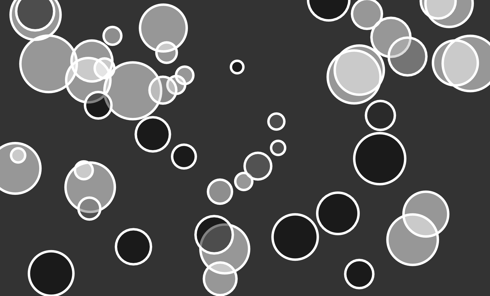
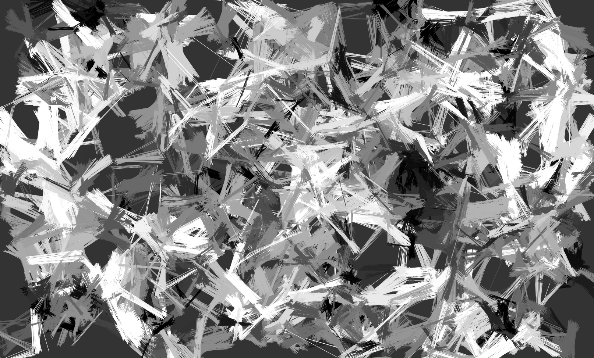

# Object communication

I created sketch while following this tutorial:

[7.6: Object Communication Part 1 - p5.js Tutorial
](https://www.youtube.com/watch?v=W1-ej3Wu5zg)

[7.7: Object Communication Part 2 - p5.js Tutorial
](https://www.youtube.com/watch?v=5Q9cA0REztY)

I'm really interested in how objects/people/things interact and communicate in the physical world. This is a great first step at learning how to model those interactions.

In the original tutorial Shiffman created bubbles that either are black or white depending on if they are overlapping. 

I expanded on it to make the bubbles fade in or out when they overlap. 

After playing with bubbles I went in a different direction. I got some inspiration from Casey Reas and drew a line connecting the centers of the bubbles when they overlapped. With varying birhgtness depending on the size of the bubbles.

## Examples

